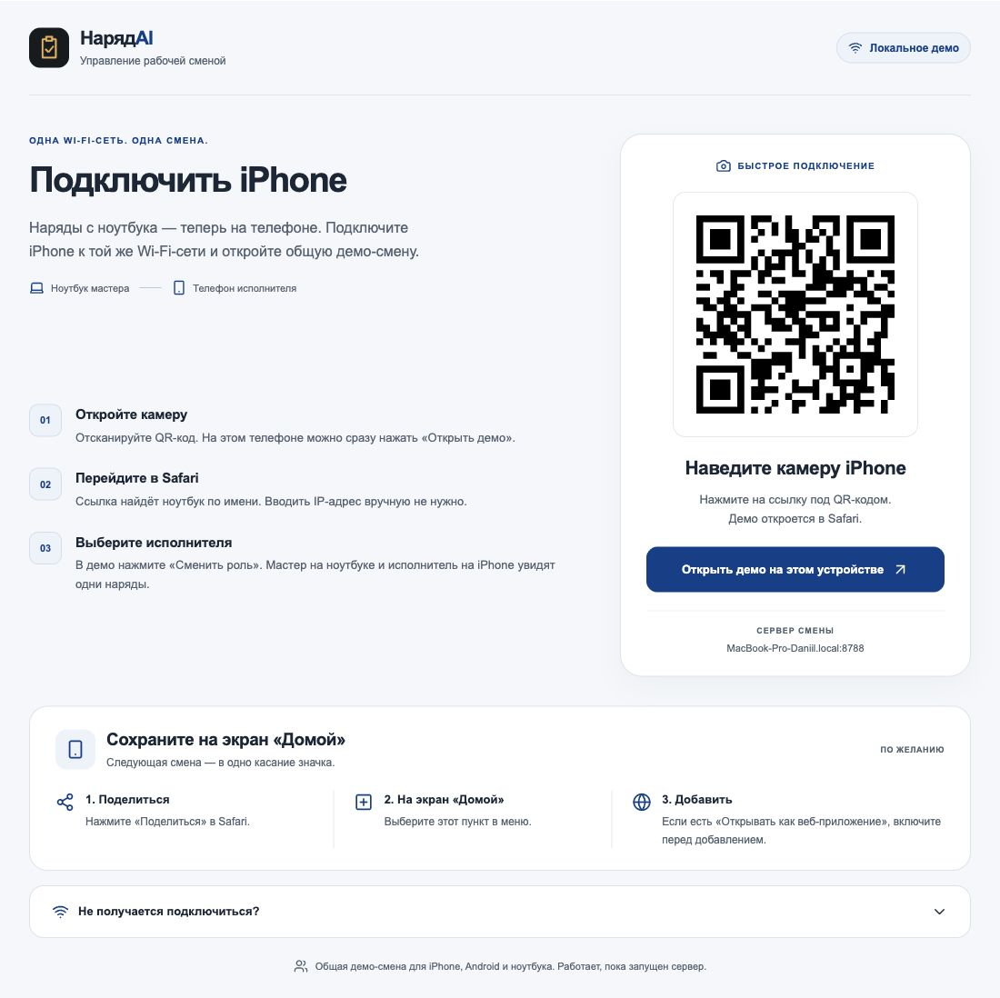

# НарядAI на iPhone

## Запуск демо сейчас

Ноутбук с запущенным `npm run start:lan` и iPhone должны находиться в одной Wi-Fi-сети.

1. На ноутбуке откройте адрес `/lan`, который выводит Start-LAN. По умолчанию: `http://127.0.0.1:8788/lan`.
2. Наведите системную камеру iPhone на QR. Он содержит имя ноутбука `.local`, поэтому IP вводить не нужно.
3. Откройте ссылку в Safari. Если страница подключения уже открыта на телефоне, нажмите «Открыть демо на этом устройстве»: кнопка сохраняет текущий адрес сервера. Если QR по имени не открывается, разверните «Не получается подключиться?» и используйте запасной QR по Wi-Fi-адресу.
4. В Safari: **Поделиться → На экран Домой**. Если доступен переключатель **Открывать как веб-приложение**, включите его и нажмите «Добавить».
5. На телефоне нажмите «Сменить роль», выберите исполнителя. На ноутбуке оставьте мастера. Наряды и изменения статуса общие с Android-телефонами.

[Инструкция Apple по добавлению сайта на экран](https://support.apple.com/guide/iphone/open-as-web-app-iphea86e5236/ios).

Это работающий браузерный путь для локального демо. HTTP не обеспечивает service worker, фоновый Web Push или гарантированную работу QR-сканера через браузерную камеру. Для открытия входного QR используется системная камера телефона. Поведение значка и отдельного окна зависит от версии iOS. После смены имени ноутбука или сервера откройте свежий QR и при необходимости добавьте значок заново.

## Страница подключения

На ноутбуке QR и три шага подключения расположены рядом. На телефоне QR и кнопка открытия идут первыми; ниже находятся инструкция для экрана «Домой» и раскрываемая помощь.



[Мобильный вид, 390 px](screenshots/iphone-connect-mobile.png).

## Нативный проект с автоматическим поиском

`ios/NaryadAI.xcodeproj` — Swift/ UIKit / WKWebView, без CocoaPods и сторонних библиотек. Минимальная iOS 15.0; поддерживаются iPhone и iPad.

В исходниках реализованы:

- `NWBrowser` ищет `_naryadai._tcp.local`, `NWConnection` разрешает адрес, проверяется HTTP-протокол сервера.
- Последний сервер запоминается, несколько серверов показываются для выбора.
- Поиск повторяется, если сервер недоступен; исчезнувшие Bonjour-кандидаты удаляются из списка.
- Системный выбор фото/камеры в WKWebView, сохранение Excel через меню «Поделиться», системная печать страницы.
- Отдельная cookie-сессия на каждом телефоне, общая LAN-база на ноутбуке.
- Описание разрешения локальной сети и Bonjour-типа в Info.plist; HTTP разрешён для локальных ресурсов через `NSAllowsLocalNetworking`.

Передача сообщения из JS разрешена только основной странице выбранного сервера. Проверка имени приложения и протокола не удостоверяет владельца криптографически: демо предназначено для доверенной локальной сети.

### Установка через Xcode на свой iPhone

1. Установите полный Xcode с iOS SDK. Command Line Tools недостаточно.
2. Откройте `ios/NaryadAI.xcodeproj`.
3. Выберите target **NaryadAI → Signing & Capabilities**. Включите Automatic Signing и выберите свою Team.
4. При необходимости задайте собственный Bundle Identifier, чтобы не конфликтовать с чужим App ID.
5. Подключите свой iPhone к Mac, выберите его как destination и нажмите Run. Следуйте системным указаниям доверия/Developer Mode, если они появятся.
6. Разрешите локальную сеть при первом поиске. Запустите сервер на ноутбуке; приложение найдёт его автоматически.

Apple поддерживает запуск на своих устройствах через Personal Team без платного членства, с ограничениями и профилем на 7 дней. [Apple Developer account overview](https://developer.apple.com/help/account/basics/about-your-developer-account/).

### Сборка

```sh
bash ios/scripts/build.sh simulator
```

Для подписанного архива при уже настроенной Apple Team:

```sh
NARYADAI_APPLE_TEAM_ID=YOUR_TEAM_ID bash ios/scripts/build.sh archive
```

Для экспорта IPA укажите свой `ExportOptions.plist`, соответствующий способу распространения и зарегистрированным устройствам:

```sh
NARYADAI_APPLE_TEAM_ID=YOUR_TEAM_ID \
NARYADAI_EXPORT_OPTIONS=/path/to/ExportOptions.plist \
bash ios/scripts/build.sh ipa
```

Команда использует авторизованную в Xcode учётную запись для подписи/профилей. Путь к Xcode можно задать через `NARYADAI_XCODE_PATH`; глобальные настройки системы скрипт не меняет.

Схема общая, проект включён в Git. После добавления/удаления файлов генератор `python3 ios/scripts/generate-project.py` воспроизводит структуру проекта. `ios/build`, пользовательские настройки Xcode, сертификаты и provisioning profiles исключены из Git и комплектов ZIP.

## Исправление зависания подготовки смены

Обнаружен конфликт двух сборок: запущенный сервер возвращал старые имена JS-чанков, а пересборка заменяла `dist/client`. Браузер получал 404 вместо кода интерфейса и оставался на «Подготавливаем рабочую смену».

Start-LAN теперь копирует сервер и клиент одной сборки в отдельную папку `.lan-runtime/site-*`. Работающий сервер читает эту согласованную копию, даже если `dist` позже пересобирается. Повторный запуск уже работающего LAN-сервера не заменяет его конфигурацию. Первичные API-запросы имеют timeout; независимый `boot-guard.js` показывает понятную кнопку обновления, если интерфейс не запустился за 15 секунд.

## Проверки и фактическое состояние

- Swift Foundation/Network-компонент скомпилирован на macOS, 14 проверок локальных адресов прошли.
- Тот же компонент реально обнаружил Bonjour-сервис, разрешил Wi-Fi-адрес и получил успешный ответ `/api/lan-discovery`. Лог: `ios/discovery-macos.txt`.
- Все Swift-файлы прошли проверку типов с доступным Mac Catalyst SDK (UIKit/WebKit/Network). Это не сборка под iPhone. Лог: `ios/catalyst-typecheck.txt`; имеется предупреждение о deprecated UIButton API.
- Info.plist и project.pbxproj прошли `plutil -lint`.
- `/lan`: HTTP 200 в LAN-режиме, HTTP 404 в обычном демо; ссылка `.local` доступна.
- Страница входа проверена в браузере при ширине 390 и 320 px, без горизонтального переполнения; раскрытие помощи показывает действующий IP/QR. Это не запуск Safari на физическом iPhone.
- Общая база двух сессий и разные роли прошли LAN-регрессию.
- После исправления загрузки интерфейс общей смены открылся в браузере; проверяются HTTP-ответы всех подключённых JS/CSS-файлов и импортов.
- TypeScript, веб-сборка, доменные правила и XLSX прошли проверки.

**IPA не собран:** на текущем Mac отсутствуют полный Xcode/iPhoneOS SDK и валидная подпись Apple. Не выполнены установка и прогон на физическом iPhone либо iOS Simulator. Системная камера, меню сохранения, печать и локальное разрешение требуют такого прогона после подписи.

Официальные API: [NWBrowser](https://developer.apple.com/documentation/network/nwbrowser), [разрешение локальной сети](https://developer.apple.com/documentation/bundleresources/information-property-list/nslocalnetworkusagedescription), [ATS для локальных ресурсов](https://developer.apple.com/documentation/bundleresources/information-property-list/nsapptransportsecurity/nsallowslocalnetworking).
